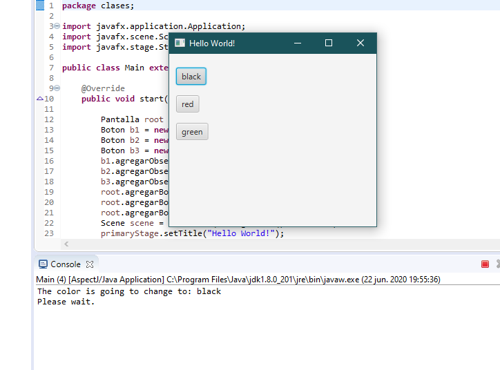
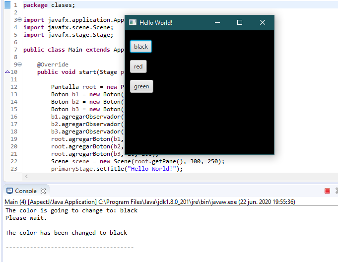

# Observer

Tarea 1 de la materia Diseño de Software. Trabajando con AspecJ y patron observer.

## Funcionalidad Adicional 🛠️

La funcionalidad adicional que hemos añadido es el informe del cambio del color antes de que la ventana cambie de color. Ademas se añadio un pequeño tiempo de espera entre la accion de aplastar el boton y el cambio de color de la ventana poder identificar de mejor manera como funcionan ambos advices, uno **before** de que la ventana cambie de color, y el otro **after** el cambio de color.

## Capturas 📷

Captura al momento de aplastar el boton "black":

    

Captura luego de 1 segundo de haber aplastado el boton "black":

    

## Integrantes ✒️

- Alex Velez **correo:** alanvele@espol.edu.ec
- Valeria Barzola **correo:** valeriadba.28@gmail.com
- Carlos Loja **correo:** caloja@espol.edu.ec
- Eddo Alvarado **correo:** eaalvara@espol.edu.ec
- Jaime Pizarro **correo:** japibaro@espol.edu.ec
